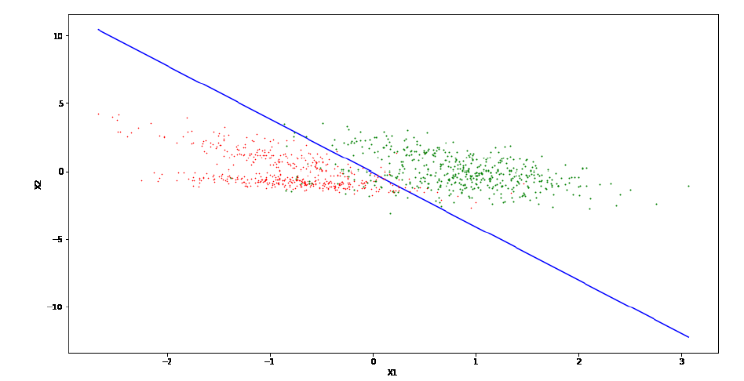

# Perceptron-Linear-Classification
This is one of our assignments for machine learning course at the University of Tehran. A two class classification was implemented by python from scratch

In this repository, we implement the Perceptron algorithm and test it for a dataset. This simple yet historically significant linear classification model, originally developed by Frank Rosenblatt in the late 1950s, assumes that the data is linearly separable and employs a step function as its activation function. It's trained through supervised learning by adjusting its weights and bias to minimize classification errors and is guaranteed to converge when data is linearly separable. However, it has limitations as it cannot handle non-linearly separable data and is sensitive to initial weight values, contributing significantly to the historical development of more complex neural network models, like Multi-Layer Perceptrons (MLP), which can address a broader range of classification problems. In this context, we have two dataset files, "train.csv" and "test.csv," each containing two features and a label with two classes, 0 and 1, which are used for training and testing the Perceptron algorithm.
